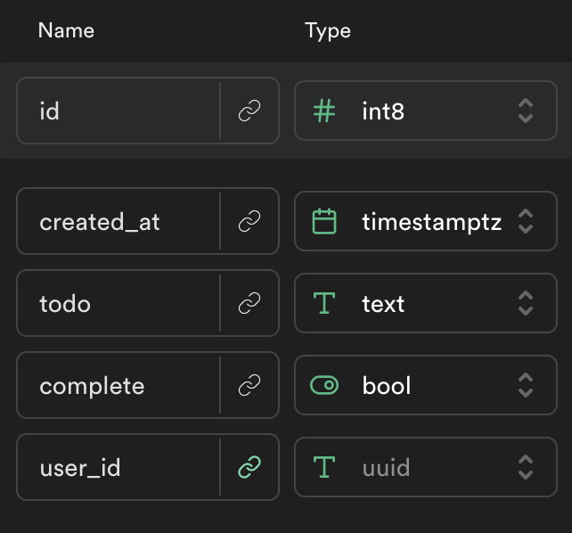

# Supabase Todo App

## Live Example:

https://alchemycodelab.github.io/web-01-todo-supabase/

## Getting Started

Use [this template](https://github.com/alchemycodelab/half-baked-web-01-todo-supabase) to get started.

## Learning Objectives

-   Perform CRUD actions on user data in supabase

## Description

Here is the schema for the `todos` table:

You will be creating a to do list using Supabase. Users should only be able to perform operations on todos associated with their user. You will be using an existing supabase database for this deliverable. Authentication has already been provided for you.

## Acceptance Criteria

-   Users should be able to add a to do item to their list (CREATE)
-   Users should be able to view all of their todos (READ)
-   Users should be able to "complete" items on their to do list (UPDATE)
-   Users should be able to delete all of their todos (DELETE)

## Rubric

The following is required for your assignment to be graded:

-   PR open from `dev` to `main`
-   PR Passes CI (lint + tests)
-   PR preview on netlify
-   At least 4 commits, for each working feature

| Task                                | Points |
| ----------------------------------- | ------ |
| **Code Requirments**                |        |
| Users see a list of all their todos | 2.5    |
| Users can add todos to the database | 2.5    |
| Users can complete todos            | 2.5    |
| Users can delete all todos          | 2.5    |
